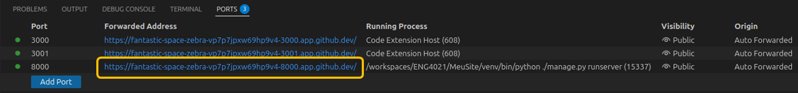

# Roteiro CRUD-1

## Observações importantes

- Os nomes `MeuSite`, `contatos, `nomeRelativoAoMeuTema` e Tema` são reservados para os exemplos. Vocês não devem usá-los. Use nomes relativos ao seu tema de trabalho.
- O tempo de cada atividade pode ser dividido entre vários membros do grupo, ou seja, uma atividade que valeria 600 XPs, se dividida por 2 componentes, valerá 300 XPs para cada um. Também pode ser dividida por 3, onde 1 componente ficará com 300 XPs e os outros 2 com 150 XPs, cada.

## Tarefas

- Criação do site baseado em Django
- Atualizar o arquivo README.md
- Implementar autenticação de usuário
- Alimentar base de dados
- Implementar consulta
- Implementar filtro na consulta

## Site baseado em Django
> Tempo estimado: menos de 1h-estudante

1. No repositório do seu projeto (pode ser no clone ou no original), abra o Codespace (crie, apenas se não existir algum Codespace).

1. No terminal, crie um `Virtual Environment` com o comando:
    ```bash
    python -m venv venv
    ```
    > Você somente terá que fazer essa operação uma vez, mas certifique-se que o diretório `venv` está presente.

1.  Ative o `venv`:
    ```bash
    source venv/bin/activate
    ```

1. Usando a interface grárica do Codespace, crie o arquivo `requirements.txt` na raiz do seu repositório. Coloque todas as dependências de módulos nesse arquivo.
    > Provavelmente, você terá que incluir no arquivo somente o modulo `django`, como você já fez anteriormente.

1. Instale as dependências:
    ```bash
    pip install -r requirements.txt
    ```
    > - Verifique se as dependências foram instaladas com sucesso
    > - Você somente terá que fazer essa operação uma vez, mas se você estiver na dúvida, pode realizar novamente porque o `pip` somente irá instalar os módulos que ainda não tiverem sido instalados.

1. Crie o seu site (substitura `MeuSite` pelo nome do seu projeto):
    ```bash
    django-admin startproject MeuSite
    ```

1. Sincronize o seu novo site com o repositório atraves do `Source Control` localizado na barra vertical de menu do lado esquerdo do Codespace.


## Arquivo README.md
> tempo estimado: menos de 3h-estudante

Termine o arquivo README. Inclua, pelo menos, as seguintes informações:
- Componentes do grupo
- Descrição do tema
- Como usar o site (com imagens)

Veja mais em:
- [Basic writing and formatting syntax](https://docs.github.com/en/get-started/writing-on-github/getting-started-with-writing-and-formatting-on-github/basic-writing-and-formatting-syntax)

## Autenticação de usuário
> tempo estimado: menos de 3h-estudante

Para saber mais sobre autenticação, visite:
- [https://docs.djangoproject.com/en/5.2/topics/auth/default/](https://docs.djangoproject.com/en/5.2/topics/auth/default/)
- [https://docs.djangoproject.com/en/5.2/ref/contrib/auth/](https://docs.djangoproject.com/en/5.2/ref/contrib/auth/)

O Django fornece um objeto User (models.User) com os seguintes campos, propriedades ou atributos:

| Propriedades | Descrição |
|---|---|
| username | nome do usuário |
| first_name | primeiro nome |
| last_name | último nome |
| email | e-mail
| password | senha |
| groups | grupos aos quais o usuário pertence |
| user_permissions | permissões do usuário |
| is_staff | se é parte do staff |
| is_active | se está ativo |
| is_superuser | se é super usuário |
| last_login | data do último login |
| date_joined | data de entrada |
| is_authenticated | se está autenticado |
| is_anonymous | se está como anonymous |

Além das propriedades listadas acima, os seguintes métodos também fazem parte do objeto User. Os parâmetros, quando existirem, são informados dentro dos parentesis. Parâmetros opcionais com o valor default são exibidos no formato `parâmetro=valor_default`.

| Método | Descrição |
|---|---|
| get_full_name() | retorna o nome completo do usuário |
| get_short_name() | retorna o primeiro nome |
| set_password(raw_password) | configura a senha |
| check_password(raw_password) | verifica se a senha está correta |
| set_unusable_password() | cria uma senha que não pode ser digitada |
| has_usable_password() | verifica se a senha não pode ser digitada |
| get_group_permissions(obj=None) | retorna as permissões que o usuário herdou do seu grupo |
| get_all_permissions(obj=None) | retorna todas as permissões do usuário |
| has_perm(perm, obj=None) | verifica se o usuário tem determinada permissão |
| has_perms(perm_list, obj=None) | verifica se o usuário tem determinadas permissões |
| has_module_perms(package_name) | verifica se o usuário tem permissão de acessar determinado módulo |
| email_user(subject, message, from_email=None, **kwargs) | envia um e-mail para o usuário |

Se você ainda não criou o superusuário da sua aplicação, faça-o agora com o comando no terminal:
```bash
python manage.py createsuperuser
```

Use a interface administrativa para criar novos usuário para você testar o seu site. Com o seu site no ar, através do navegador, acesse a URL do seu site seguida por /admin. Veja o exemplo a seguir. Verifique na aba `Ports` o link para o seu site. Por exemplo:
```
https://effective-space-q57x4g4c499-8000.app.github.dev/
```
Copie o link e cole em um navegador. Acrescente `admin/` no final do link e entre na aplicação de administração usando as credenciais do superusuário que você criou anteriormente.
```
https://effective-space-q57x4g4c499-8000.app.github.dev/admin/
```



Certifique-se de haver registrado a aplicação usuario no arquivo `settings.py`:

```python
# Application definition

INSTALLED_APPS = [
   "django.contrib.admin",
   "django.contrib.auth",
   "django.contrib.contenttypes",
   "django.contrib.sessions",
   "django.contrib.messages",
   "django.contrib.staticfiles",
   "usuario",
   "nomeRelativoAoMeuTema",
]
```

Configure as origens aceitáveis para o Django incluindo a seguinte lista no seu arquivo `settings.py`:
```python
CSRF_TRUSTED_ORIGINS = [
   'https://localhost:8000',
   'https://127.0.0.1:8000',
]
```

Informe a rota que deve ser seguida após o login criando a seguinte variável no arquivo `settings.py`. Note a `/` antes e depois da rota. Substitua meuTema pela rota adequada. Informe também a página seguinte ao logout.
```python
LOGIN_REDIRECT_URL = '/meuTema/home/'
LOGOUT_REDIRECT_URL = '/accounts/login/'
```

Inclua as rotas de `django.contrib.auth.urls` no seu arquivo `urls.py` principal, localizado na pasta MeuSite/MeuSite (troque MeuSite pelo nome do seu projeto). Veja a figura a seguir.

Ao incluir essa path, as seguintes rotas são automaticamente incluídas no seu site (acrescente a URL do seu projeto à rota):
- accounts/login/
    - Nome 'login'
    - Necessita da página registration/login.html
    - Usa a variável settings.LOGIN_REDIRECT_URL
    - Método GET
- accounts/logout/
    - Nome 'logout'
    - Usa a variável settings.LOGOUT_REDIRECT_URL
    - Somente método POST
- accounts/password_change/
    - Nome 'password_change'
    - accounts/password_change/done/
    - Nome 'password_change_done'
- accounts/password_reset/
    - Nome 'password_reset'
- accounts/password_reset/done/
    - Nome 'password_reset_done'
- accounts/reset/<uidb64>/<token>/
    - Nome 'password_reset_confirm'
- accounts/reset/done/
    - Nome 'password_reset_complete'

Em crie a pasta `templates/registration/` dentro da pasta usuario. Nessa pasta crie o arquivo `login.html`. Use esse exemplo para criar o arquivo. Ele deve conter, pelo menos, o formulário para o usuário entrar com as credenciais.

Crie links no seu site para o usuário poder fazer login e logout!

Proteja as páginas que somente podem ser acessadas após o login usando o decorador `@login_required` nas funções dos `views` como mostrado no exemplo a seguir:
```python
from django.shortcuts import render
from django.contrib.auth.decorators import login_required
@login_required
def paginaSecreta(request):
  # pode haver mais código aqui!
  return render(request, 'seguranca/paginaSecreta.html')
```

Se for para proteger um view que está definido em uma classe, extenda a classe para ser derivada também de LoginRequiredMixin como mostra o exemplo a seguir:
```python
from django.contrib.auth.mixins import LoginRequiredMixin
class ClasseProtegida(LoginRequiredMixin, View):
  def get(self, request, *args, **kwargs):
    # pode haver mais código aqui!
    return render(request, 'chatsec/inicio.html')
   
  def post(self, request, *args, **kwargs):
    # pode haver mais código aqui!
    return render(request, 'chatsec/inicio.html')
```

##Base de Dados
> tempo estimado: menos de 3h-estudante

Use a interface administrativa para criar as informações do seu banco de dados.

Não se esqueça de migrar o banco de dados se houver alguma modificação em algum dos modelos ou se o Django avisar que deve realizar uma migração.

## Página de consulta
> tempo estimado: menos de 2h-estudante

Crie na sua aplicação tema:
- Um view para renderizar uma página de consulta que liste todo o seu banco de dados
- Um template html para exibir todo o seu banco de dados
- Uma rota para esse view
Veja um exemplo de um view que busca todos os contatos em um banco de dados e renderiza um template para exibir os dados em um navegador. Adapte-o para o seu caso:
- View criado dentro da pasta da sua aplicação-tema (não é a aplicação principal). Lembre-se de proteger esse view, mas somente depois que ele funcionar. No meu exemplo, Pessoas é o nome da tabela do banco de dados que contém as informações dos contatos - veja o import do models.
```python
from django.shortcuts import render
from contatos.models import Pessoa
from django.views.generic.base import View
class ContatoListView(View):
 def get(self, request, *args, **kwargs):
  pessoas = Pessoa.objects.all()
  contexto = { 'pessoas': pessoas, }
  return render(request, 'contatos/listaContatos.html', contexto)
```
- Template criado dentro da pasta da sua aplicação, dentro da pasta templates.
```html

<!DOCTYPE html>
<html>
<head>
<meta charset="UTF-8">
<title>Lista Contatos</title>
<link rel="stylesheet" href="">
</head>
<body>
  <h1>Lista de Contatos</h1>
  <table>
    <tr><th>Nome</th><th>Idade</th><th>Salário</th></tr>
    
      <tr>
        <td>{{ pessoa.nome }}</td>
        <td>{{pessoa.idade }}</td>
        <td>{{ pessoa.salario }}</td>
      </tr>
    
      <tr>
        <th colspan=“3">
          Ainda não tem contatos cadastrados
        </th>
      </tr>
    
  </table>
</body>
</html>
```

## Consulta com filtro
> tempo estimado: menos de 3h-estudante por conjunto de páginas

Implemente várias consultas no seu site. Nós ainda não sabemos criar atualizações, mas podemos fazê-las através da interface administrativa (usando /admin na url do site).

No exemplo anterior, nós usamos:
```
pessoas = Pessoa.objects.all()
```
Para trazer todas as pessoas do banco de dados. Podemos modificar essa declaração para buscar somente o que queremos usando o método filter:
```python
objects.all().filter(campo1='condição1', campo2='condição2',)
```
Por exemplo, para buscar um nome que seja exatamente ‘Ana’:
```python
objects.all().filter(nome='Ana')
```
Para buscar um nome que contenha `ana` (note o duplo sublinhado abaixo):
`objects.all().filter(nome__icontains='ana')`
Exiba o resultado da mesma forma que foi implementado no item anterior.

Para cada conjunto, você deve criar:
- Um template para permitir ao usuário informar a busca desejada (texto da busca).
- Um view para renderizar a página descrita acima. Esse view provavelmente deverá ser protegido (mas faça isso somente se for necessário e somente depois que ele estiver funcionando).
- Uma rota para esse view.
- Um template para exibir o resultado da consulta.
- Um view para realizar a consulta.
- Uma rota na sua aplicação (não é na aplicação principal).
- Links para navegar até a página de busca.

Em resumo, cada consulta vai demandar:
- 2 views
- 2 templates
- 2 rotas

Exemplo para buscar uma pessoa na lista de contatos:
- URLs (2 urls)
```python
from django.urls.conf import path
from contatos import views

app_name = 'contatos'

urlpatterns = [
  # pode ter mais rotas aqui nessa lista
  path('busca/', views.buscaUmContato, name='busca-contato'),
  path('retorno-busca/', views.respostaBuscaUmContato, name='mostra-contato'),
]
```

Views (2 views)
```python
def buscaUmContato(request):
  return render(request, 'contatos/buscaUmContato.html')

def respostaBuscaUmContato(request):
  pessoas = Pessoa.objects.all().filter(
    nome__icontains=request.GET.get('nome'))
  contexto = { 'pessoas': pessoas, }
  return render(request, 'contatos/listaContatos.html', contexto)
```
Template buscaUmContato.html
```html

<!DOCTYPE html>
<html lang="en">
<head>
   <meta charset="UTF-8">
   <meta name="viewport" content="width=device-width, initial-scale=1.0">
   <title>Busca um contato</title>
</head>
<body>
   <h1>Busca de contato</h1>
   <form action="" method="get">
       Nome: <input type="text" name="nome" id="nome">
       <button type="submit">Busca</button>
   </form>
</body>
</html>
```
Template listaContatos.html
```html

<!DOCTYPE html>
<html>
<head>
<meta charset="UTF-8">
<title>Lista Contatos</title>
<link rel="stylesheet" href="">
</head>
<body>
   <h1>Lista de Contatos</h1>
   <table>
       <tr><th>Nome</th><th>Idade</th><th>Salário</th></tr>
       
           <tr>
               <td>{{ pessoa.nome }}</td><td>{{pessoa.idade }}</td><td>{{ pessoa.salario }}</td>
          </tr>
       
           <tr><th colspan="3">Ainda não tem contatos cadastrados</th></tr>
       
   </table>
</body>
</html>
```
