# Uso do Github

Este guia explica como **vários alunos podem colaborar** em um mesmo projeto no GitHub — no caso, o repositório fictício chamado `ENG4021`.

> Modifique o nome do repositório de acordo com o seu projeto

O fluxo descrito abaixo usa **forks** (cópias individuais no GitHub) e **GitHub Codespaces** (ambientes de edição online).

## Links úteis

- https://docs.github.com/en/get-started/writing-on-github/getting-started-with-writing-and-formatting-on-github/basic-writing-and-formatting-syntax
- https://docs.github.com/en/codespaces/setting-up-your-project-for-codespaces/adding-a-dev-container-configuration/introduction-to-dev-containers

## CENÁRIO GERAL

| Papel | Usuário | Função |
|-------|----------|--------|
| Dono do projeto | `aluno1` | Repositório principal (`ENG4021`) |
| Colaboradores | `aluno2`, `aluno3`, ... | Criam forks e enviam Pull Requests (`PRs`) |

## Fazer o *fork* do repositório

Cada aluno acessa o projeto principal: https://github.com/aluno1/ENG4021 (não clique nesse link, ele **não** existe - use o link do repositório do seu projeto).

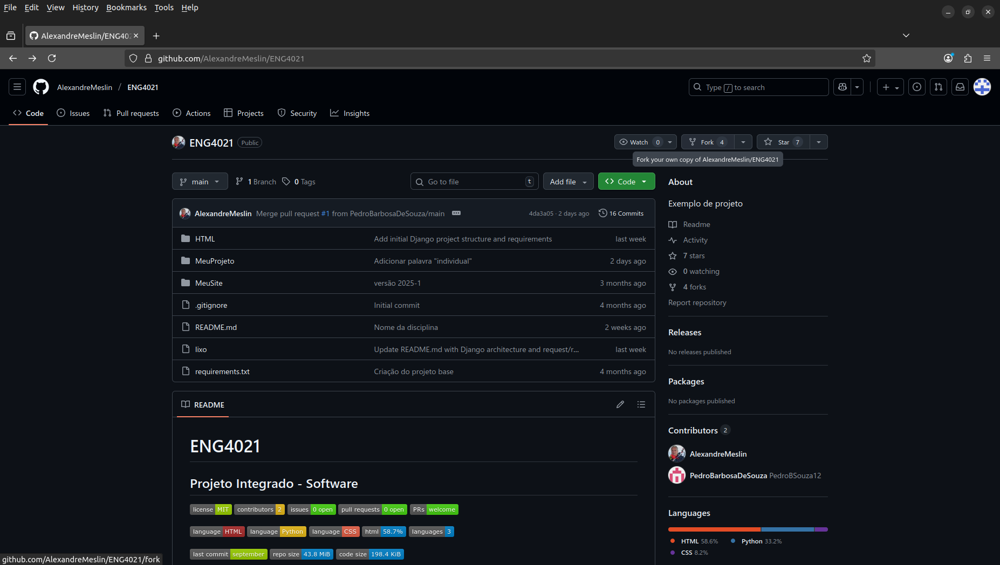

E clica em **Fork** (no canto superior direito da tela).


Depois clique em **Create fork**.

O GitHub criará uma cópia pessoal do repositório, por exemplo (aluno2, aluno3, ... não existem, vai aparecer a sua conta no Github):
- `https://github.com/aluno2/ENG4021`
- `https://github.com/aluno3/ENG4021`

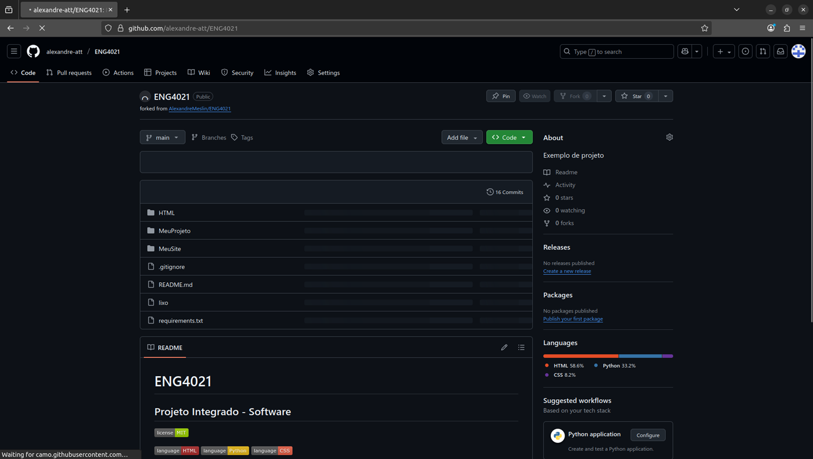

## Abrir o repositório fork no Codespace

1. No fork (`aluno2/ENG4021`), clique em **Code → Codespaces → Create codespace on main**.

    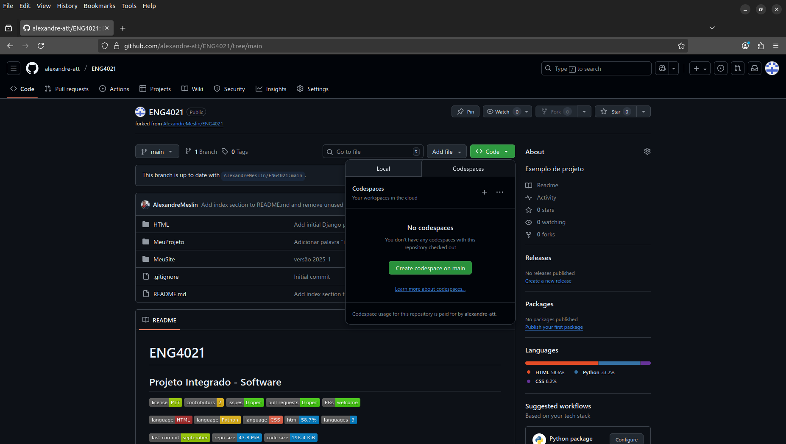

    Se já houver algum Codespace criado, apenas clique no link, **não** crie um novo Codespace.

    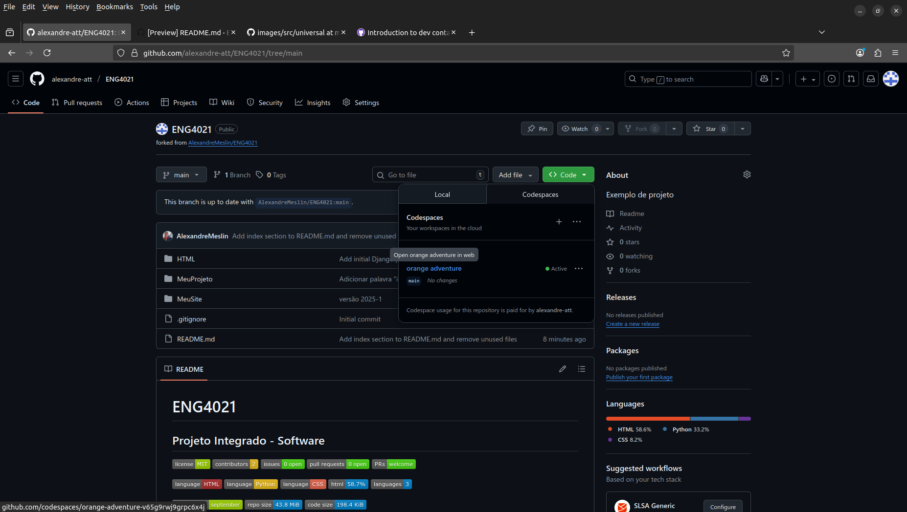

1. Aguarde o ambiente ser criado.  
   > O Codespace é como um **VS-Code** rodando no navegador.

   > Nesse momento, você tem uma cópia do *fork* que você fez do repositório original, ou seja, uma cópia da cópia.

## Fazer modificações

Edite normalmente os arquivos no Codespace. 
Por exemplo, altere `src/main.c` e `README.md`.

Para verificar mudanças:

```bash
git status
```

Saída esperada:

```text
modified: src/main.c
modified: README.md
```

Ou se você tiver criado (não apenas modificado) algum arquivo, a saída esperada pode ser outra:

```text
On branch main
Your branch is up to date with 'origin/main'.

Changes not staged for commit:
  (use "git add <file>..." to update what will be committed)
  (use "git restore <file>..." to discard changes in working directory)
        modified:   README.md

Untracked files:
  (use "git add <file>..." to include in what will be committed)
        GIT/

no changes added to commit (use "git add" and/or "git commit -a")
```

## Fazer commit e push no fork

> Aqui você vai atualizar o seu repositório clonado, aquele que você fez o *fork*. Você **não** vai atualizar o repositório do seu projeto. Isso vai ser feito mais abaixo.

Após editar, no terminal, digite:

```bash
git add .
git commit -m "Atualiza função principal e README"
git push origin main
```

Agora suas alterações estão no seu fork (aluno2/ENG4021).

## Criar um Pull Request (PR)

No GitHub (aluno2/ENG4021):

1. Clique em `Contribute` → `Open pull request`.

    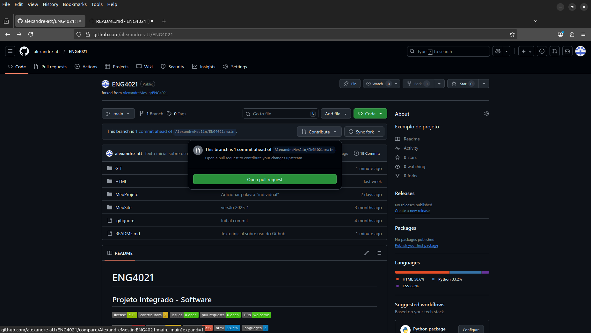

1. Verifique:

    ```
    base repository: aluno1/ENG4021     ← destino (repositório principal)
    head repository: aluno2/ENG4021     ← origem (seu fork)
    ```

1. Adicione um título e uma descrição das mudanças.

    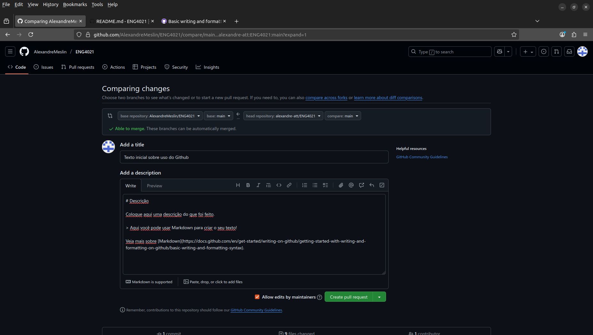

1. Clique em `Create pull request`.

    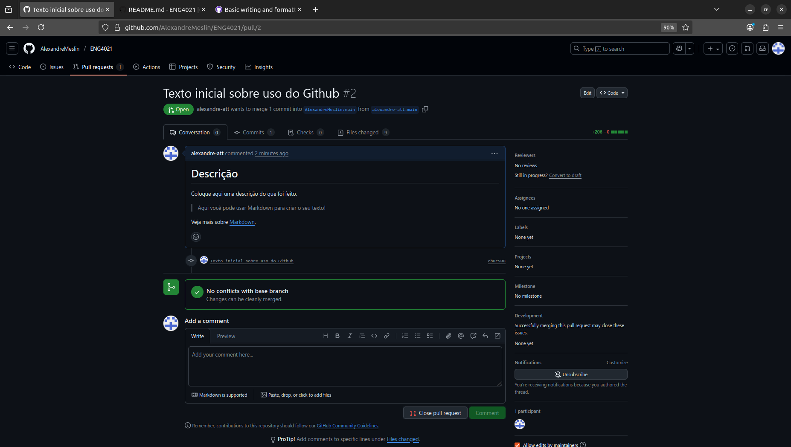

## Revisão pelo dono do repositório

O aluno1 verá o PR em:

```bash
https://github.com/aluno1/ENG4021/pulls
```

O **PR** também pode ser visto pela interface Web observando o link `Pull request`. No seu lado direito, você verá a quantidade de PRs pendentes.

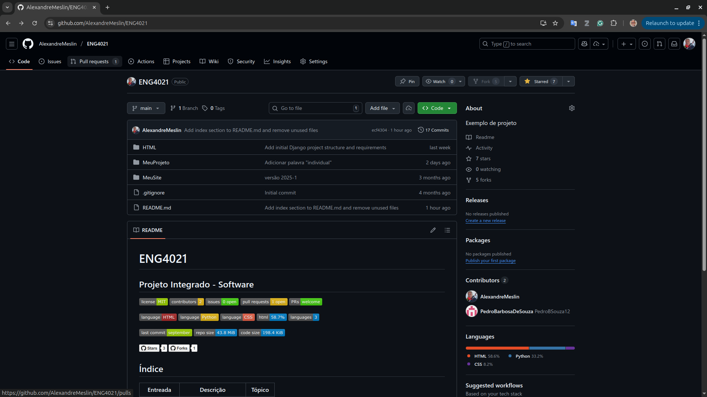

Ele pode:
- Analisar o código modificado.
- Comentar ou solicitar alterações.
- Fazer o merge quando estiver tudo certo.

Quando o merge é feito, as mudanças entram no repositório principal.

1. Clique no link `Pull requests`

    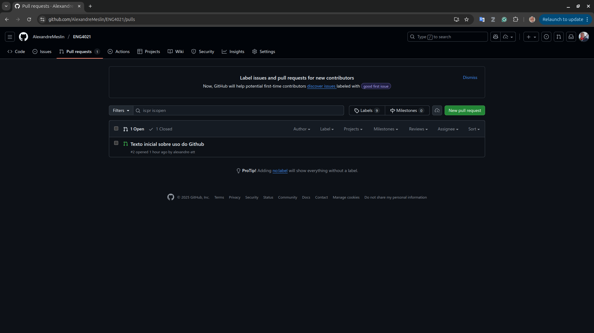

1. Clique no PR que você deseja realizar o merge:

    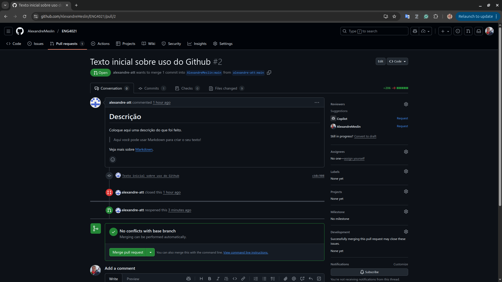

1. Se não houver problemas, clique em `Merge pull request` e depois em `Confirm merge` para confirmar o *merge* .

    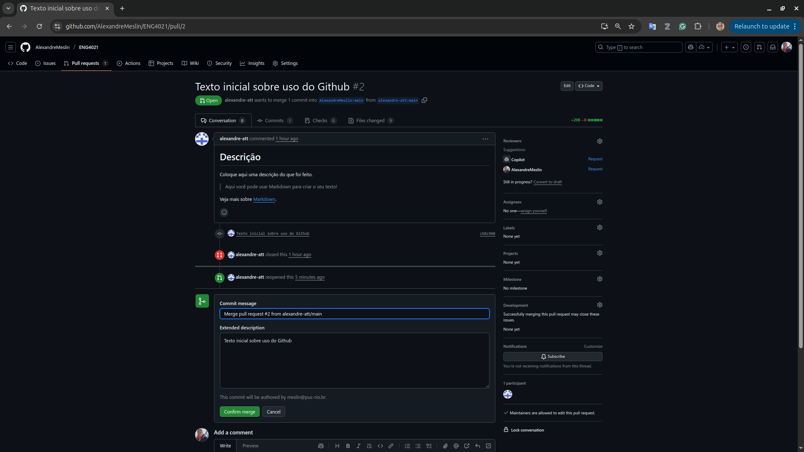

## Atualizar o fork com o repositório principal

Quando aluno1 aceita um PR ou altera algo diretamente, os outros forks ficam desatualizados.
Cada aluno deve sincronizar o fork com o original antes de novas modificações:

```bash
# Adicionar o repositório principal (de aluno1)
git remote add upstream https://github.com/aluno1/ENG4021.git

# Buscar as atualizações
git fetch upstream

# Mesclar com sua branch principal
git checkout main
git merge upstream/main

# Atualizar o fork remoto
git push origin main
```

## Comandos essenciais
```bash
# Ver status dos arquivos
git status

# Adicionar todos os arquivos modificados
git add .

# Fazer commit com mensagem
git commit -m "Descrição da modificação"

# Enviar commit para o fork
git push origin main

# Atualizar fork com repositório original
git remote add upstream https://github.com/aluno1/ENG4021.git
git fetch upstream
git merge upstream/main
git push origin main
```

## Dicas úteis

- Faça commits pequenos e frequentes, com mensagens claras.
- Antes de editar, sempre atualize seu fork com git fetch upstream.
- No PR, descreva bem as alterações e a motivação.
- O `aluno1` pode usar a aba Pull Requests para revisar e comentar.

# Problemas conhecidos e suas "soluções"

## Origem e local divergem

### Sintoma

```ascii
From https://github.com/AlexandreMeslin/ENG4021
 * branch            main       -> FETCH_HEAD
hint: You have divergent branches and need to specify how to reconcile them.
hint: You can do so by running one of the following commands sometime before
hint: your next pull:
hint:
hint:   git config pull.rebase false  # merge
hint:   git config pull.rebase true   # rebase
hint:   git config pull.ff only       # fast-forward only
hint:
hint: You can replace "git config" with "git config --global" to set a default
hint: preference for all repositories. You can also pass --rebase, --no-rebase,
hint: or --ff-only on the command line to override the configured default per
hint: invocation.
fatal: Need to specify how to reconcile divergent branches.
```

### Solução (mais conservadora)

```bash
git pull --tags origin main --no-rebase
```

Resultado esperado:

```ascii
From https://github.com/AlexandreMeslin/ENG4021
 * branch            main       -> FETCH_HEAD
Merge made by the 'ort' strategy.
 GIT/img/GIT-TelaSyncFork.png | Bin 0 -> 154035 bytes
 README.md                    |   4 ++--
 2 files changed, 2 insertions(+), 2 deletions(-)
 create mode 100644 GIT/img/GIT-TelaSyncFork.png
```
