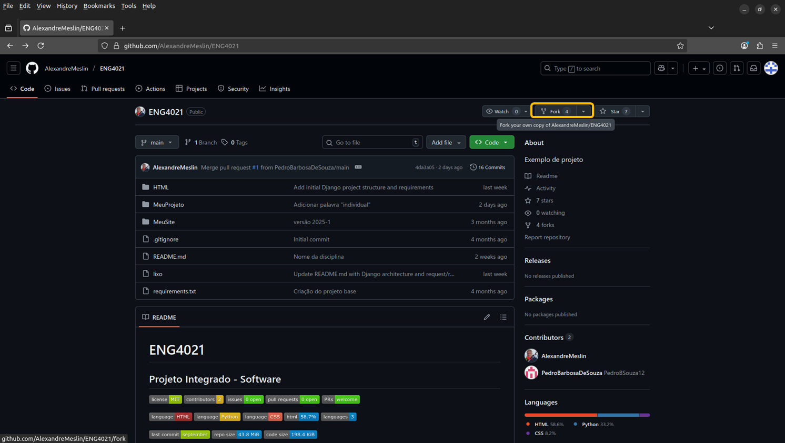
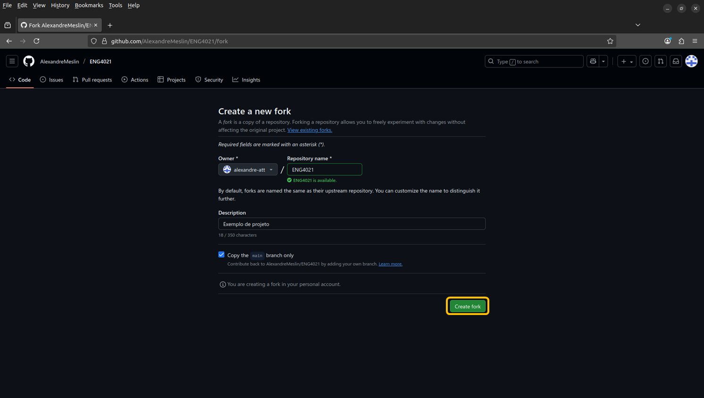
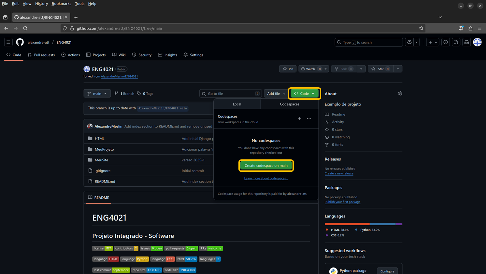
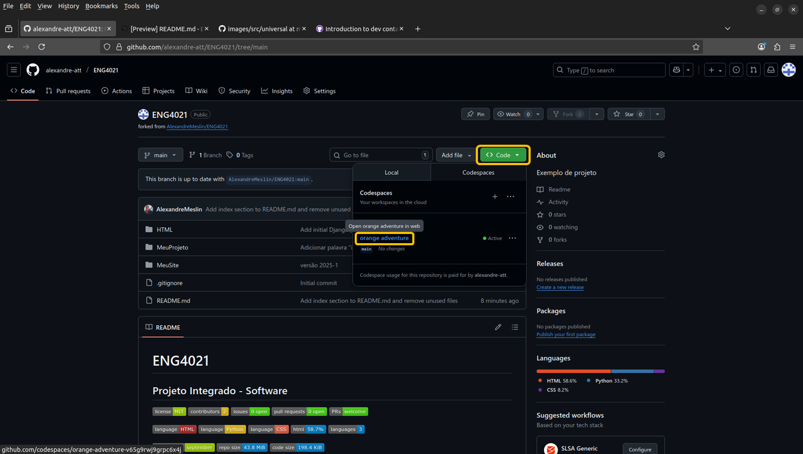

# Uso do Github

Este guia explica como **vários alunos podem colaborar** em um mesmo projeto no GitHub — no caso, o repositório fictício chamado `ENG4021`.

> Modifique o nome do repositório de acordo com o seu projeto

O fluxo descrito abaixo usa **forks** (cópias individuais no GitHub) e **GitHub Codespaces** (ambientes de edição online).

---

## CENÁRIO GERAL

| Papel | Usuário | Função |
|-------|----------|--------|
| Dono do projeto | `aluno1` | Repositório principal (`ENG4021`) |
| Colaboradores | `aluno2`, `aluno3`, ... | Criam forks e enviam Pull Requests (`PRs`) |

## Fazer o *fork* do repositório

Cada aluno acessa o projeto principal: https://github.com/aluno1/ENG4021 (não clique nesse link, ele **não** existe - use o link do repositório do seu projeto).



E clica em **Fork** (no canto superior direito da tela).



Depois clique em **Create fork**.

O GitHub criará uma cópia pessoal do repositório, por exemplo (aluno2, aluno3, ... não existem, vai aparecer a sua conta no Github):
- `https://github.com/aluno2/ENG4021`
- `https://github.com/aluno3/ENG4021`


## Abrir o repositório fork no Codespace

1. No fork (`aluno2/ENG4021`), clique em **Code → Codespaces → Create codespace on main**.

    

    Se já houver algum Codespace criado, apenas clique no link, **não** crie um novo Codespace.

    

1. Aguarde o ambiente ser criado.  
   > O Codespace é como um **VS-Code** rodando no navegador.

   > Nesse momento, você tem uma cópia do *fork* que você fez do repositório original, ou seja, uma cópia da cópia.

## Fazer modificações

Edite normalmente os arquivos no Codespace.  
Por exemplo, altere `src/main.c` e `README.md`.

Para verificar mudanças:

```bash
git status
```

Saída esperada:

```text
modified: src/main.c
modified: README.md
```

Ou se você tiver criado (não apenas modificado) algum arquivo, a saída esperada pode ser outra:

```text
On branch main
Your branch is up to date with 'origin/main'.

Changes not staged for commit:
  (use "git add <file>..." to update what will be committed)
  (use "git restore <file>..." to discard changes in working directory)
        modified:   README.md

Untracked files:
  (use "git add <file>..." to include in what will be committed)
        GIT/

no changes added to commit (use "git add" and/or "git commit -a")
```

## Fazer commit e push no fork
Após editar:

```bash
git add .
git commit -m "Atualiza função principal e README"
git push origin main
```

Agora suas alterações estão no seu fork (aluno2/ENG4021).

## Criar um Pull Request (PR)

No GitHub (aluno2/ENG4021):

Clique em Contribute → Open pull request

Verifique:

yaml
Copy code
base repository: aluno1/ENG4021     ← destino (repositório principal)
head repository: aluno2/ENG4021     ← origem (seu fork)
Adicione um título e uma descrição das mudanças.

Clique em Create pull request.

🔍 6. Revisão pelo dono do repositório
O aluno1 verá o PR em:

bash
Copy code
https://github.com/aluno1/ENG4021/pulls
Ele pode:

Analisar o código modificado.

Comentar ou solicitar alterações.

Fazer o merge quando estiver tudo certo.

Quando o merge é feito, as mudanças entram no repositório principal.

⚙️ 7. Atualizar o fork com o repositório principal
Quando aluno1 aceita um PR ou altera algo diretamente, os outros forks ficam desatualizados.
Cada aluno deve sincronizar o fork com o original antes de novas modificações:

bash
Copy code
# Adicionar o repositório principal (de aluno1)
git remote add upstream https://github.com/aluno1/ENG4021.git

# Buscar as atualizações
git fetch upstream

# Mesclar com sua branch principal
git checkout main
git merge upstream/main

# Atualizar o fork remoto
git push origin main
🧠 Resumo do fluxo
diff
Copy code
+--------------------------------------+
| aluno1/ENG4021 (repositório oficial) |
|                                      |
|   ↑ Pull Requests (aluno2, aluno3)   |
+--------------------------------------+
        ↑                 ↑
        |                 |
  Fork de aluno2     Fork de aluno3
 (Codespace)         (Codespace)
🧰 Comandos essenciais
bash
Copy code
# Ver status dos arquivos
git status

# Adicionar todos os arquivos modificados
git add .

# Fazer commit com mensagem
git commit -m "Descrição da modificação"

# Enviar commit para o fork
git push origin main

# Atualizar fork com repositório original
git remote add upstream https://github.com/aluno1/ENG4021.git
git fetch upstream
git merge upstream/main
git push origin main
🧩 Dicas úteis
Faça commits pequenos e frequentes, com mensagens claras.

Antes de editar, sempre atualize seu fork com git fetch upstream.

No PR, descreva bem as alterações e a motivação.

O aluno1 pode usar a aba Pull Requests para revisar e comentar.

📘 Exemplo visual (simplificado)
perl
Copy code
aluno1/ENG4021 ────────┐
                       │ Pull Request
                       │
aluno2/ENG4021 (fork) ─┤
                       │
aluno3/ENG4021 (fork) ─┘
📄 Licença e boas práticas
Certifique-se de manter o mesmo arquivo de licença (ex: MIT) do repositório original,
e de incluir seu nome nos comentários dos arquivos em que trabalhou.

Autor original do projeto: aluno1
Colaboradores via fork: aluno2, aluno3, ...
Ambiente de desenvolvimento: GitHub Codespaces
Fluxo de colaboração: Fork → Edit → Commit → PR → Merge → Sync