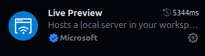

# Roteiro de HTML/CSS

# HTML

1. Crie um repositório - não use o mesmo repositório do seu projeto com o seu time. Ao criar o repositório, inclua o arquivo `README.md` e o arquivo `.gitignore` para `Python`.

1. Abra o Codespace do seu repositório.

1. Crie uma pasta chamada `HTML` para os arquivos HTML. Dentro dessa pasta, crie uma pasta chamada `css` e outra chamada `img` para você armazenar as folhas de estilo e as imagens, respectivamente.

1. Crie um arquivo chamado `index.html` na pasta `HTML`.

1. Insira o seguinte código (basta digitar `html` e selecionar a opção `HTML 5`):
    ```html
    <!DOCTYPE html>
    <html lang="en">
    <head>
        <meta charset="UTF-8">
        <meta name="viewport" content="width=device-width, initial-scale=1.0">
        <title>Document</title>
    </head>
    <body>
        
    </body>
    </html>
    ```

1. Troque o idioma para português do Brasil e inclua um título para a aba do navegador.

1. Coloque o conteúdo desse [arquivo](./conteudo.txt) entre as tags `<body>` e `</body>`.

1. Instale o *plugin* `Live Preview` da **Microsoft** e depois digite `Ctrl+K` `V` para abrir a visualização.

    

    Utilize o plugin para visualizar cada uma das modificações que você fizer no documento.

1. Formate o título principal com a tag `<h1>`.

    > A marcação da tag começa com a tag e termina com barra-tag. Por exemplo:
    >```HTML
    > <h1>Título do texto</h1>
    >```

1. Formate os títulos secundários com a tag `<h2>`.

1. Coloque os parágrafos dentro das tags `<p>`.

1. Copie essa [figura](Spiff/img/spiff.jpeg) para a pasta `img`

1. Inclua a figura na sua página usando a tag `img` como mostrado a seguir: 
    ```html
    
    ```
1. Em uma parte do texto, crie uma lista numerada usando a tag `<ol></ol>` envolvendo todos os elementos da lista. Envolva individualmente cada um dos elementos da lista com a tag `<li></li>`.

1. Em outra parte do texto, crie uma lista não-numerada (com *bullets*) substituindo a tag `<ol>` pela tag `<ul>`.

1. Antes do seu texto (antes de tudo, mas ainda dentro de `<body>`), crie um container usando a tag `<nav>`. Copie o seguinte texto para dentro desse container: 
    ```ascii
    Menu Estelar
    PUC-Rio
    Resumo
    Habilidades
    Educação
    Idiomas
    Versão 2
    Meu currículo
    ```
1. Coloque a 1a linha como título principal.

1. Crie um link para o site da PUC-Rio usando a tag `<a>` como mostrado a seguir:
    ```html
    <a href="http://www.puc-rio.br">PUC-Rio</a>
    ```

1. Crie um arquivo chamado `meu-curriculo.html` na pasta `HTML`.

1. Inclua um link para esse arquivo como mostrado a seguir:
    ```html
    <a href="meu-curriculo.html">Meu currículo</a>
    ```

1. Inclua links para seções do seu arquivo usando o seguinte formato:
    ```html
    <a href="#resumo">Resumo</a>
    ```
    E envolva cada uma das seções do seu texto `HTML` com a tag `<section>` como mostrado a seguir:
    ```html
    <section id="resumo">
    ```
    > A identificação (`id`) dever ser única

1. Crie uma seção `<footer>`.

1. Coloque todo o texto (menos o que estiver em `<nav>` e `<footer>`) dentro de `<main>`.

1. Inclua no texto, uma tabela com as disciplinas que você já cursou com:
    - Código da disciplina
    - Nome da disciplina
    - Ano e semestre
    - Nome do professor
    
    Uma tabela é escrita dentro de `<table>`. Cada linha da tabela é escrita dentro de `<tr>` e cada célula (conteúdo) é escrita dentro de `<td>`. Uma tabela também pode ter células de cabeçalho (com destaque) escritas dentro de `<th>`. Opcionalmente, por motivos semânticos, uma tabela também pode (deve) ter `<thead>`, `<tbody>` e `<tfoot>`. Por exemplo:
    ```html
    <table>
        <thead>
            <tr>
                <th>Aluno 1</th>
                <th>Aluno 2</th>
                <th>Aluno 3</th>
            </tr>
        </thead>
        <tbody>
            <tr>
                <td>Araci do Precioso Sangue</td>
                <td>Asteroide Silverio</td>
                <td>Cafiaspirina Cruz</td>
            </tr>
            <tr>
                <td>8</td>
                <td>7</td>
                <td>5</td>
            </tr>
        </tbody>
        <tfoot>
            <tr>
                <td>Rodapé 1</td>
                <td>Rodapé 2</td>
                <td>Rodapé 3</td>
            </tr>
        </tfoot>
    </table>
    ```

# CSS - Cascading Style Sheets

1. Troque a cor de fundo da página para preto. As cores podem ser especificadas pelo seu nome (o resultado não é exato) ou pela quantidade de Vermelho (R), Verde (G) e Azul (B), com valores variando, para cada um, entre 0 e 255, em decimal, ou o seu equivalente em hexadecimal, onde 0 é a total ausência do compontente na cor e 255 é a quantidade máxima do componente. Os valores em hexadecimal são escritos com `#` antes do número. Por exemplo, uma letra vermelha pode ser descrita como:

    ```css
    p {
        color: red;
    }
    ```
    ou
    ```css
    p {
        color: #FF0000;
    }
    ```

    > Note que o VS-Code mostra um quadrado com a cor selecionada numericamente.

    A cor de fundo de um elemento é dada pelo atributo `background-color`.

1. Troque a cor dos textos dos parágrafos para branco, ou seja, o valor máximo de `RGB`.

1. Troque também o tipo de fonte para `Orbitron` através do atributo `font-family`.

1. Mude a cor de fundo da barra de navegação para azul.

1. No seu código HTML, coloque os links de navegação em uma lista não numerada. Coloque essa lista na classe `navegacao` usando o atributo class. Na folha de estilo, crie uma classe `.navegacao` como mostrado a seguir. Examine o efeito dessa classe nos links de navegação.
    ```css
    .navegacao {
       list-style-type: none; /* Escreva aqui o efeito */
    }
    ```

1. Remova o sublinhado dos links e troque a sua cor para amarelo, mas somente dos links que estiverem dentro de um objeto da classe `navegacao`. Para isso, no CSS, informe o nome da classe seguido da tag para criar link. Para remover o sublinhado, use atributo `text-decoration` e coloque o seu valor como `none`.

1. Coloque os títulos `h1`, `h2` e `h3` com texto amarelo e margem a esquerda de 10px.

1. Alinhe os parágrafos com os títulos.

1. Coloque o texto do rodapé como laranja.

1. Coloque o sumário do currículo dentro de um container do tipo `<div>`. Identifique esse container como `sumario`. Troque a cor do texto e do alinhamento desse texto. Para referenciar esse container no CSS, use o formato `#sumario`.

# Próxima Aula

>Na próxima aula iremos resolver o problema da *responsividade*  da página.
