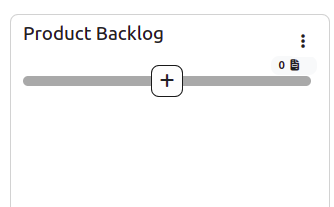
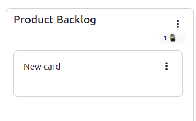
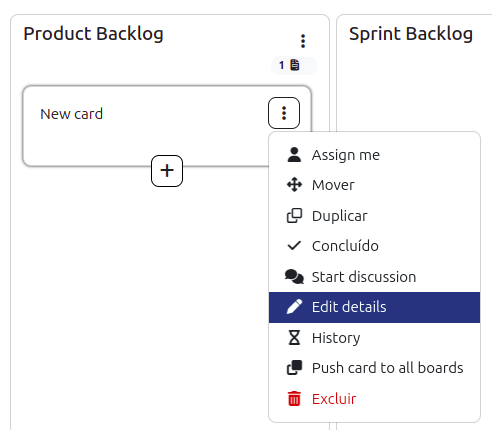
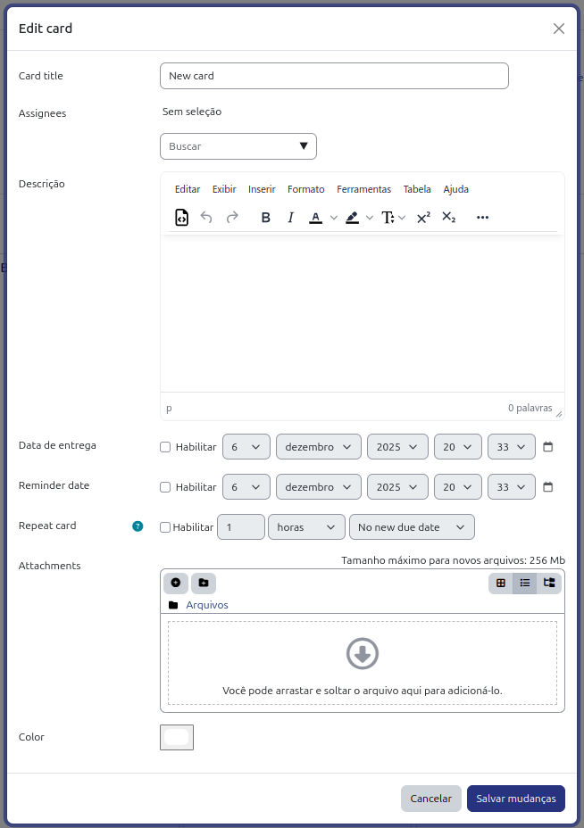
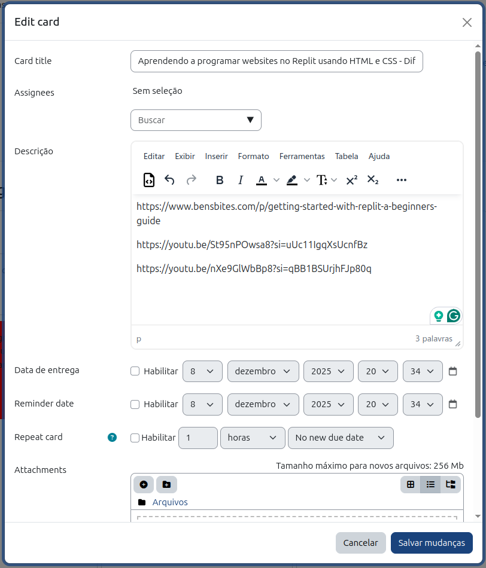
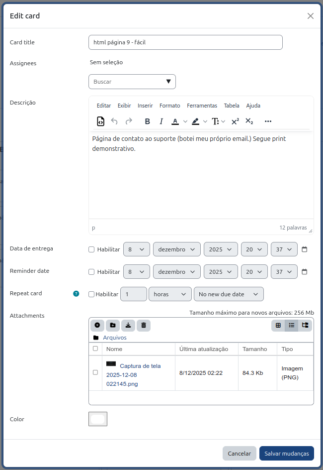

# Kanban

Este diretório contém recursos e documentação relativa à metodologia de gerência de projeto usando Kanban.
Kanban é um método visual de gerência de fluxo de trabalho que ajuda equipes a visualizar seu trabalho, limitar o trabalho em progresso e maximizar a eficiência.

## Tarefas

Cada membro deve fazer uma das configurações de tarefas abaixo:

- 6 tarefas fáceis;
- 3 tarefas médias;
- 1 tarefa difícil e 1 tarefa média;
- 1 tarefa muito difícil;

Também existem as combinações trocando 1 média por 2 fáceis.

- Tarefa Fácil: >= 15 min e < 1 hora;
- Tarefa Média: >= 1 hora e < 2 horas;
- Tarefa Difícil: >= 2 horas e < 3 horas;
- Tarefa Muito Difícil: >= 3 horas.

As tarefas devem ser concluídas até 23:59 da 5a feira da semana da sprint.

## Como criar um card

Para criar um card no Kanban, siga os passos abaixo:

1. Acesse o quadro Kanban da equipe.

1. Coloque o mouse um pouco abaixo do topo da coluna `Product Backlog`

1. Clique no botão `+` para criar um novo card em branco.

1. No novo card, clique nos três pontos verticais e selecione `Edit details`

1. Preencha as informações do card conforme o modelo abaixo:

    - Card title: coloque o nome da atividade e o grau de dificuldade
        - Exemplo: Página HTML home.html - Fácil
        - Exemplo: 

Exemplos de cards errados:

| Card | Motivo do erro |
|---|---|
| Página HTML home.html | Não especifica o grau de dificuldade |
|| Tecnologia fora do nosso escopo (Replit) |
|| Anexou arquivo no lugar de incluir um link para o arquivo no repositório do time|