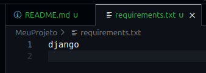
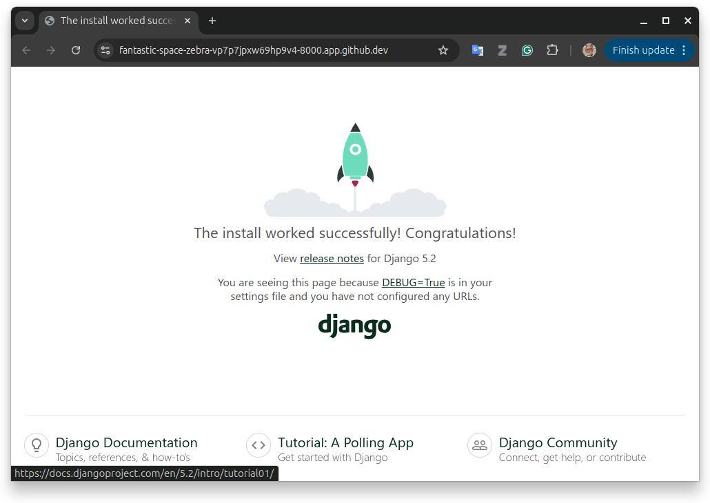
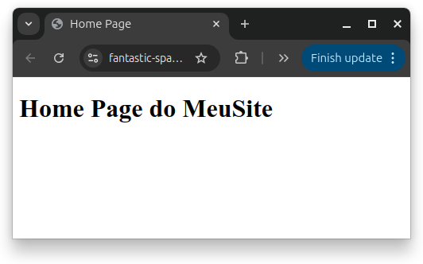

# Trabalhando com Django
[https://www.djangoproject.com/](https://www.djangoproject.com/)

## Antes de tudo...

Você criou um repositório particular para a aula de HTML.
Para completar esse roteiro, você vai usar o mesmo repositório. **Não use o repositório do seu projeto!**

> `Diretório`, `pasta` e `folder` são sinônimos.

## Entendendo um pouco sobre o Django

O MTV (Model-Template-View) é o padrão arquitetural que o Django utiliza, que é uma variação do conhecido MVC (Model-View-Controller).

```
┌─────────────┐    ┌─────────────┐    ┌─────────────┐
│    MODEL    │ ←→ │    VIEW     │ ←→ │   TEMPLATE  │
│             │    │             │    │             │
│ Lógica de   │    │ Lógica de   │    │ Apresentação│
│ Dados       │    │ Negócio     │    │ (HTML/CSS)  │
└─────────────┘    └─────────────┘    └─────────────┘
```

1. O model é responsável por descrever como os dados serão organizados no Django, incluindo a interação com o banco de dados. As classes que definem os dados são armazenadas nos arquivos `models.py`.

1. O template é um conjunto de páginas HTML/CSS/JavaScript responsável pela apresentação. Os arquivos HTML ficam no diretório `templates` enquanto os arquivos CSS e JavaScript no diretório `static`.

1. O view é um conjunto de funções e classes com seus respectivos métodos responsáveis pela lógica de negócio, ou seja, responsável por receber as requisições HTTP, processar os dados e renderizar os templates. As classes e as funções ficam nos arquivos `views.py`.

### Fluxo de requisição e resposta (request/response)

O fluxo de uma requisição HTTP pode ser resumido assim:

```
USUÁRIO
    ↓ (Faz requisição HTTP)
urls.py (Roteamento)
    ↓ (Encaminha para view apropriada)
views.py (Lógica de negócio)
    ↓ (Consulta dados)
models.py (Banco de dados - opcional)
    ↓ (Retorna dados)
views.py (Processa dados)
    ↓ (Prepara contexto)
templates/ (Renderiza HTML)
    ↓ (Retorna resposta)
USUÁRIO (Vê resultado)
```

### Árvore de diretórios e arquivos (mais importantes)

Exemplo de uma estrutura típica de um projeto Django:

```
MeuProjeto/
├── MeuSite
│   ├── MeuSite
│   │   ├── asgi.py
│   │   ├── settings.py
│   │   ├── templates
│   │   │   └── MeuSite
│   │   │       └── home.html
│   │   ├── urls.py
│   │   ├── views.py
│   │   └── wsgi.py
│   ├── curriculo
│   │   ├── admin.py
│   │   ├── apps.py
│   │   ├── models.py
│   │   ├── static
│   │   │   └── curriculo
│   │   │       ├── css
│   │   │       │   ├── curriculo-v0.css
│   │   │       │   ├── curriculo-v1.css
│   │   │       │   └── curriculo-v2.css
│   │   │       ├── img
│   │   │       │   ├── aircraft-spiff.gif
│   │   │       │   └── spiff.jpeg
│   │   │       └── js
│   │   ├── templates
│   │   │   └── curriculo
│   │   │       ├── curriculo-v1.html
│   │   │       └── curriculo-v2.html
│   │   ├── tests.py
│   │   ├── urls.py
│   │   └── views.py
│   ├── db.sqlite3
│   └── manage.py
├── requirements.txt
└── venv
```

### Funcionamento

1. O usuário faz uma requisição (HTTP request).

    Por exemplo: o usuário acessa `http://example.com/curriculo/spiff/`

1. O Django verifica a URL em `urls.py` localizada no diretório do projento principal.

    No arquivo `urls.py` existe um mapeamento de rotas para views e inclusão de outras rotas de outras aplicações.

    ```python
    urlpatterns = [
        path("admin/", admin.site.urls),
        path('', views.home, name='home'),  # Map the home view to the root URL
        path('curriculo/', include('curriculo.urls')),  # Include the curriculo app URLs
    ]
    ```

    Como o diretório referenciado pela URL começa por `curriculo/`, o Django vai procurar a rota no arquivo `urls.py` na aplicação `curriculo`. O arquivo deve conter algo parecido com:

    ```python
    urlpatterns = [
        path('spiff/', views.curriculo_spiff, name='curriculo_spiff'),
        path('spiff/v2/', views.curriculo_spiff_v2, name='curriculo_spiff_v2'),
    ]
    ```

    No nosso exemplo, o restante dos diretórios dão *match* com a rota `spiff`. Nesse caso, o *view* `curriculo_spiff` vai ser executado.

    Esse *view* vai processar o pedido (*request*), preparar os dados e renderizar um dos *templates* para responder (*response*) ao usuário.

## Configurando o ambiente

1. Abra o Codespace.

1. Na raiz do seu repositório, crie um diretório chamado `MeuProjeto`. Você vai desenvolver o seu site Django dentro desse diretório. Nesse diretório, você poderá ter:
    - Versão desktop da sua aplicação
    - Versão web da sua palicação
    - Recursos necessários para a sua aplicação
    - Configurações gerais
    - Arquivo `requirements.txt`

1. Crie o arquivo `requirements.txt` no seu diretório `MeuProjeto`. Esse arquivo conterá todas as dependências de pacotes do seu projeto. No arquivo, inclua a linha `django`.

    

1. Vamos agora criar um *virtual environment*. 
    - No terminal do Codespace, vá para o diretório do seu projento digitando:
        ```bash
        cd MeuProjeto
        ```
        O *prompt* da linha de comando deverá agora conter o nome do seu projeto (`MeuProjeto (main) $ `). Para verificar se você realmente está no lugar certo, use o comando:
        ```bash
        ls -l
        ```
        e verifique se o resultado foi parecido com esse:
        ```bash
        @AlexandreMeslin ➜ /workspaces/ENG4021/MeuProjeto (main) $ ls -l
        total 12
        -rw-rw-rw-  1 codespace codespace    7 Oct 10 20:36 requirements.txt
        ```
    - Crie o *virtual environment* com o comando a seguir:
    ```bash
    python -m venv venv
    ```
    Esse comando vai criar um diretório chamado `venv`. Veja explicação no Apêncide A.

    - Ative o `venv` com o seguinte comando:
    ```bash
    source venv/bin/activate
    ```
    Nesse ponto, o seu `prompt` deverá começar por `(venv)`, como por exemplo, no meu caso:
    ```bash
    (venv) @AlexandreMeslin ➜ /workspaces/ENG4021/MeuProjeto (main) $ 
    ```

    - Uma vez criado o `venv`, instale as dependências com o seguinte comando:
    ```bash
    pip install -r requirements.txt
    ```
    O resultado esperado deve ser parecido com esse:
    ```
    Collecting django (from -r requirements.txt (line 1))
    Obtaining dependency information for django from https://files.pythonhosted.org/packages/8f/ef/81f3372b5dd35d8d354321155d1a38894b2b766f576d0abffac4d8ae78d9/django-5.2.7-py3-none-any.whl.metadata
    Downloading django-5.2.7-py3-none-any.whl.metadata (4.1 kB)
    Collecting asgiref>=3.8.1 (from django->-r requirements.txt (line 1))
    Obtaining dependency information for asgiref>=3.8.1 from https://files.pythonhosted.org/packages/17/9c/fc2331f538fbf7eedba64b2052e99ccf9ba9d6888e2f41441ee28847004b/asgiref-3.10.0-py3-none-any.whl.metadata
    Downloading asgiref-3.10.0-py3-none-any.whl.metadata (9.3 kB)
    Collecting sqlparse>=0.3.1 (from django->-r requirements.txt (line 1))
    Obtaining dependency information for sqlparse>=0.3.1 from https://files.pythonhosted.org/packages/a9/5c/bfd6bd0bf979426d405cc6e71eceb8701b148b16c21d2dc3c261efc61c7b/sqlparse-0.5.3-py3-none-any.whl.metadata
    Downloading sqlparse-0.5.3-py3-none-any.whl.metadata (3.9 kB)
    Downloading django-5.2.7-py3-none-any.whl (8.3 MB)
    ━━━━━━━━━━━━━━━━━━━━━━━━━━━━━━━━━━━━━━━━ 8.3/8.3 MB 39.9 MB/s eta 0:00:00
    Downloading asgiref-3.10.0-py3-none-any.whl (24 kB)
    Downloading sqlparse-0.5.3-py3-none-any.whl (44 kB)
    ━━━━━━━━━━━━━━━━━━━━━━━━━━━━━━━━━━━━━━━━ 44.4/44.4 kB 12.4 MB/s eta 0:00:00
    Installing collected packages: sqlparse, asgiref, django
    Successfully installed asgiref-3.10.0 django-5.2.7 sqlparse-0.5.3

    [notice] A new release of pip is available: 23.2.1 -> 25.2
    [notice] To update, run: pip install --upgrade pip
    ```

## Criando o site

1. Crie o seu site
    
    Usando o terminal, crie um projeto Django chamado `MeuSite`:
    ```bash
    django-admin startproject MeuSite
    ```
    Esse comando irá criar vários diretórios deixando a sua árvore parecida com essa:
    ```
    MeuProjeto/
    ├── MeuSite
    │   ├── MeuSite
    │   │   ├── __init__.py
    │   │   ├── asgi.py
    │   │   ├── settings.py
    │   │   ├── urls.py
    │   │   └── wsgi.py
    │   └── manage.py
    ├── requirements.txt
    └── venv
    ```

1. Teste o seu site.
    - Desça para o diretório `MeuSite`
    ```bash
    cd MeuSite
    ```
    - Suba o servidor com o seguinte comando:
    ```bash
    python manage.py runserver
    ```
    Resultado esperado:
    ```
    Watching for file changes with StatReloader
    Performing system checks...

    System check identified no issues (0 silenced).

    You have 18 unapplied migration(s). Your project may not work properly until you apply the migrations for app(s): admin, auth, contenttypes, sessions.
    Run 'python manage.py migrate' to apply them.
    October 10, 2025 - 21:10:36
    Django version 5.2.7, using settings 'MeuSite.settings'
    Starting development server at http://127.0.0.1:8000/
    Quit the server with CONTROL-C.

    WARNING: This is a development server. Do not use it in a production setting. Use a production WSGI or ASGI server instead.
    For more information on production servers see: https://docs.djangoproject.com/en/5.2/howto/deployment/
    ```

    - Use o link oferecido pelo Codespace para examinar o seu site. Opcionamente você pode selecionar a aba `PORTS` e abrir o link que está relacionado à porta 8000.
    Resultado esperado:

    

    > Para parar o seu site, basta digitar Ctrl+C no terminal.

    > Repita esse procedimento para colocar o seu site no ar sempre que necessário.

1. Algumas configurações básicas...

    - Inclua o seu site na lista de aplicações do seu projeto editando o arquivo `settings.py` e inclua a sua aplicação na lista de aplicações instaladas como mostrado:
    ```python
    # Application definition

    INSTALLED_APPS = [
        "django.contrib.admin",
        "django.contrib.auth",
        "django.contrib.contenttypes",
        "django.contrib.sessions",
        "django.contrib.messages",
        "django.contrib.staticfiles",
        'MeuSite',  # incluir esse!
    ]
    ```

1. Vamos criar uma home-page para o seu site.

    Criar uma página inicial (home-page) para um site Django envolve a coordenação de quatro componentes principais: a `URL`, o `View` e o `Template`.

    - Definindo o template HTML.

        O template é o código HTML que define a estrutura visual da sua página inicial.

        - Crie um diretório chamado `templates` dentro do diretório `MeuSite\MeuSite`
        - Crie um diretório chamado `MeuSite` dentro do diretório `templates`
        - Crie um arquivo HTML dentro do diretório `MeuSite/MeuSite/templates/MeuSite` chamado `home.html`

        Resultado esperado:
        ```
        MeuProjeto/
        ├── MeuSite
        │   ├── MeuSite
        │   │   ├── asgi.py
        │   │   ├── settings.py
        │   │   ├── templates
        │   │   │   └── MeuSite
        │   │   │       └── home.html
        │   │   ├── urls.py
        │   │   └── wsgi.py
        │   ├── db.sqlite3
        │   └── manage.py
        ├── requirements.txt
        └── venv
        ```

        - Crie um conteúdo qualquer no seu arquivo `home.html`.

    - Crie o View (lógica)

        O View é uma função Python que recebe uma requisição HTTP, processa a lógica (se necessário) e retorna uma resposta, geralmente renderizando um template.

        - crie o arquivo `views.py` no diretório `MeuSite/MeuSite` com o seguinte conteúdo:

        >  Se for copia e colar, cuidado com o alinhamento!

        ```python
        from django.shortcuts import render

        def home(request):
            '''
            View function for home page of site.
            Renders the home.html template.
            '''
            return render(request, 'MeuSite/home.html')
        ```

    - Configure as URLs do Aplicativo em `urls.py`

    No arquivo `urls.py`, mapeie a função `home` para um caminho vazio (''). O arquivo deve ficar semelhante a esse:
    ```python
    """
    URL configuration for MeuSite project.

    The `urlpatterns` list routes URLs to views. For more information please see:
        https://docs.djangoproject.com/en/5.2/topics/http/urls/
    Examples:
    Function views
        1. Add an import:  from my_app import views
        2. Add a URL to urlpatterns:  path('', views.home, name='home')
    Class-based views
        1. Add an import:  from other_app.views import Home
        2. Add a URL to urlpatterns:  path('', Home.as_view(), name='home')
    Including another URLconf
        1. Import the include() function: from django.urls import include, path
        2. Add a URL to urlpatterns:  path('blog/', include('blog.urls'))
    """

    from django.contrib import admin
    from django.urls import path
    from MeuSite import views  # Import the home view

    urlpatterns = [
        path("admin/", admin.site.urls),

        # Add the home view URL pattern
        # Map the home view to the root URL
        path('', views.home, name='home'),  # Map the home view to the root URL
    ]
    ```

    - Teste a sua home-page colocando o site no ar. Resultado esperado:

    


1. A sua aplicação principal se chama `MeuSite`. Mas vamos criar uma aplicação secundária chamada `curriculo`.

    - Pare o servidor Django digitando Ctrl+C no terminal.

    - Crie a aplicação secundaria com o comando:
    ```bash
    python manage.py startapp curriculo
    ```
    Esse comando deverá deixar a árvore de diretórios com esse formato:
    ```
    MeuProjeto/
    ├── MeuSite
    │   ├── MeuSite
    │   │   ├── __init__.py
    │   │   ├── __pycache__
    │   │   │   ├── __init__.cpython-312.pyc
    │   │   │   ├── settings.cpython-312.pyc
    │   │   │   ├── urls.cpython-312.pyc
    │   │   │   └── wsgi.cpython-312.pyc
    │   │   ├── asgi.py
    │   │   ├── settings.py
    │   │   ├── urls.py
    │   │   └── wsgi.py
    │   ├── curriculo
    │   │   ├── __init__.py
    │   │   ├── admin.py
    │   │   ├── apps.py
    │   │   ├── migrations
    │   │   │   └── __init__.py
    │   │   ├── models.py
    │   │   ├── tests.py
    │   │   └── views.py
    │   ├── db.sqlite3
    │   └── manage.py
    ├── img
    │   ├── Django-AloMundo.png
    │   └── requirements-django.png
    ├── requirements.txt
    └── venv
    ```

    - Registre a sua aplicação editando o arquivo `settings.py`:
    ```python
    # Application definition

    INSTALLED_APPS = [
        "django.contrib.admin",
        "django.contrib.auth",
        "django.contrib.contenttypes",
        "django.contrib.sessions",
        "django.contrib.messages",
        "django.contrib.staticfiles",
        'MeuSite',      # esse já deveria existir aqui
        'curriculo',    # esse é novo
    ]
   ```

1. Vamos colocar os currículos no ar

    - Arquivos estáticos

        O Django considera a folha de estilo, as mídias e os scripts em JavaScript como arquivos estáticos. Eles devem ser colocados dentro de um diretório chamado `static` dentro de cada uma das aplicações.

        - Crie um diretório chamado `static` dentro do diretório `curriculo`
        - Dentro do diretório `static`, crie um diretório chamado `curriculo`. Dentro desse diretório, crie os seguintes diretórios
            - js
            - img
            - css
        - Copie (**copiar, não mover**) as suas folhas de estilo para entro do diretório `css`.
        - Copie (**copiar, não mover**) as suas imagens para entro do diretório `img`.

    - Templates de currículos

        - Crie um diretório chamado `templates` dentro do diretório `MeuSite\curriculo`. Dentro de `templates`, crie um diretório chamado `curriculo`.
        - Copie (**copiar, não mover**) o currículo do Spiff e o currículo que você criou para esse último diretório.

        Nesse ponto, você deverá ter uma árvore de diretórios semelhante a essa:
        ```
        MeuProjeto/
        ├── MeuSite
        │   ├── MeuSite
        │   │   ├── asgi.py
        │   │   ├── settings.py
        │   │   ├── templates
        │   │   │   └── MeuSite
        │   │   │       └── home.html
        │   │   ├── urls.py
        │   │   ├── views.py
        │   │   └── wsgi.py
        │   ├── curriculo
        │   │   ├── admin.py
        │   │   ├── apps.py
        │   │   ├── models.py
        │   │   ├── static
        │   │   │   └── curriculo
        │   │   │       ├── css
        │   │   │       │   ├── curriculo-v0.css
        │   │   │       │   ├── curriculo-v1.css
        │   │   │       │   └── curriculo-v2.css
        │   │   │       ├── img
        │   │   │       │   ├── aircraft-spiff.gif
        │   │   │       │   └── spiff.jpeg
        │   │   │       └── js
        │   │   ├── templates
        │   │   │   └── curriculo
        │   │   │       ├── curriculo-v1.html
        │   │   │       └── curriculo-v2.html
        │   │   ├── tests.py
        │   │   └── views.py
        │   ├── db.sqlite3
        │   └── manage.py
        ├── requirements.txt
        └── venv
        ```
        - Edite os seus arquivos HTML e faça as seguintes modificações:
            - Coloque a seguinte linha como primeira linha de cada um dos arquivos HTML. Essa linha instrui ao Django para carregar os arquivos estáticos ao renderizar a página.
            ```
            
            ```
            - Substitua **TODAS** as referências às suas folhas de estilo, de:
            ```html
            <link rel="stylesheet" href="css/curriculo-v0.css">
            ```
            Para:
            ```html
            <link rel="stylesheet" href="">
            ```
            - Substitua **TODAS** as referências às suas imagens, de:
            ```html
            
            ```
            Para:
            ```html
            
            ```

    - View para os currículos
    
    Crie um view para cada um dos currículos do seu site editando o arquivo `MeuSite/curriculo/views.py`. Resultado esperado (parecido com esse, mas não necessariamente igual):
    ```python
    from django.shortcuts import render

    # Create your views here.

    def curriculo_spiff(request):
        '''
        View function for the astronaut Spiff's resume page.
        Renders the curriculo-v1.html template.
        This will display the resume page when the corresponding URL is accessed
        The curriculo_spiff view is responsible for displaying the content of the resume page
        It is a simple function-based view
        It takes a request object as a parameter
        It returns a rendered HTML response
        @param request: The HTTP request object
        @return: Rendered HTML response with resume page content
        '''
        return render(request, 'curriculo/curriculo-v1.html')

    def curriculo_spiff_v2(request):
        '''
        View function for the astronaut Spiff's resume page version 2.
        A responsive version of the resume page.
        Renders the curriculo-v2.html template.
        This will display the resume page version 2 when the corresponding URL is accessed
        The curriculo_spiff_v2 view is responsible for displaying the content of the resume page version 2
        It is a simple function-based view
        It takes a request object as a parameter
        It returns a rendered HTML response
        @param request: The HTTP request object
        @return: Rendered HTML response with resume page version 2 content
        '''
        return render(request, 'curriculo/curriculo-v2.html')
    ```

    - Rotas para os currículos

    Crie o arquivo `MeuSite/curriculo/urls.py`. Nesse arquivo, inclua rotas para os currículos criados. Veja o seguinte exemplo (o seu arquivo não precisa ficar exatamente igual a esse):
    ```python
    from django.urls import path
    from . import views

    app_name = 'curriculo'

    urlpatterns = [
        # essa rota pode ser acessada em /curriculo/spiff/
        # ou seja, /curriculo/ + spiff/
        # o link para essa rota pode ser criado usando o nome 'curriculo_spiff'
        # Exemplo: 
        path('spiff/', views.curriculo_spiff, name='curriculo_spiff'),
        # essa rota pode ser acessada em /curriculo/spiff/v2/
        path('spiff/v2/', views.curriculo_spiff_v2, name='curriculo_spiff_v2'),
    ]
    ```

    Inclua esse arquivo de rotas no conjunto de rotas do seu site editando o arquivo `MeuSite/MeuSite/urls.py`:
    ```python
    """
    URL configuration for MeuSite project.

    The `urlpatterns` list routes URLs to views. For more information please see:
        https://docs.djangoproject.com/en/5.2/topics/http/urls/
    Examples:
    Function views
        1. Add an import:  from my_app import views
        2. Add a URL to urlpatterns:  path('', views.home, name='home')
    Class-based views
        1. Add an import:  from other_app.views import Home
        2. Add a URL to urlpatterns:  path('', Home.as_view(), name='home')
    Including another URLconf
        1. Import the include() function: from django.urls import include, path
        2. Add a URL to urlpatterns:  path('blog/', include('blog.urls'))
    """

    from django.contrib import admin
    from django.urls import path
    from MeuSite import views  # Import the home view
    from django.urls import include  # Import include to include app URLs

    urlpatterns = [
        path("admin/", admin.site.urls),

        # Add the home view URL pattern
        # Map the home view to the root URL
        path('', views.home, name='home'),  # Map the home view to the root URL
        path('curriculo/', include('curriculo.urls')),  # Include the curriculo app URLs
    ]
    ```

    - Na home-page do seu site, no arquivo `home.html`, inclua links para os currículos, por exemplo:
    ```html
    <!DOCTYPE html>
    <html lang="en">
    <head>
        <meta charset="UTF-8">
        <meta name="viewport" content="width=device-width, initial-scale=1.0">
        <title>Home Page</title>
    </head>
    <body>
        <h1>Home Page do MeuSite</h1>

        <h2>Links para os currículos</h2>
        <ul>
            <li><a href="">Currículo do Spiff</a></li>
            <li><a href="">Currículo responsivo do Spiff</a></li>
        </ul>
    </body>
    </html>
    ```

    - Teste o seu site


# Apendices

## Apendice A

Criando um venv:

Use o comando:
```bash
python -m venv venv
```

Explicação:

| Token | Descrição |
|:---:|---|
| python | Nome do interpretador Python |
|-m | run library module as a script (terminates option list) |
| venv | (o primeiro) Nome do módulo a ser executado - esse módulo cria um *virtual environment* |
| venv | (o segundo) Nome do *virtual environment* a ser criado |
